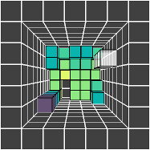
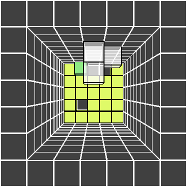

# Blocks in Space

This game is heavily based on xblockout and is like tetris with an extra
dimension: blocks move in space rather than in a plane.  Fill up a plane at
the bottom instead of merely a row in order to make it disappear.

However, unique to this game, the rate at which the blocks fall at doesn't
increase.  Instead the complexity of the blocks themselves does.

I am writing this in order to learn clojure while at the same time creating a
game that I'd like to play.  It's in an early development state.

## Usage

### Running the game

Requires [leiningen 2](http://leiningen.org/#install).  From source directory, start game with

    $ lein run

### How the game works

Blocks appear at the "top" (screen-direction) and "fall" towards the "bottom"
(away from the screen).  The current falling block is semi-transparent so that
you can see the what exists at the bottom.  Blocks that have already fallen
change color, with colors indicating the height of each cube (light and yellow
at the bottom, dark and red at the top, moving through most of the spectrum in
between.)

I have been told there are people that have never played tetris, but I'm not
sure I believe it.  Just in case:

* You lose if the blocks stack up over the top of the grid area.

* You avoid this by filling in a complete plane at any height, which makes all
  those cubes disappear and those above fall to fill the gap.  Your score is
  the number of times you do this, and is indicated by a number on the left
  side of the screen.

Besides the obvious addition of a dimension, this game has one important
difference from tetris:

* As you clear planes and progress in the game, you will start seeing more and
  more complex blocks.

### Keybindings

Move:

      I
    J K L

Move down:

    space

Rotate, turning top towards this direction:

      E
    S D F

Rotate counterclockwise and clockwise, respectively:

    W   R

Pause (also start game initially)

    P

## Issues

### Known bugs

* Rather than moving as necessary, blocks simply don't rotate at all if you
  attempt to rotate next to a wall that they would rotate into
* Sometimes possible to play a little more after game over
* Blocks at top show wrong color at game over

### Important missing features

* Ability to start a new game after losing
* A way to quickly drop all the way instead of just one level
* A color key to block height (at least it's a spectrum unlike xblockout, but
  if there's a situation where there might be no blocks on a certain level it
  can be hard to tell)
* Show keybindings in-game
* Add more complex shapes indefinitely
* Better code
* Tests (while I don't mind lots of manual testing since the point is that I
  enjoy playing it, eventually I should figure out what kind of tests are best
  for functional programming)
* Display text with nice looking font/size/position/color
* Stand-alone jar
* Pause should hide the current state; currently it's a bit like cheating

## License

Copyright © 2013 Cayenne Geis

Distributed under the Eclipse Public License, the same as Clojure.
